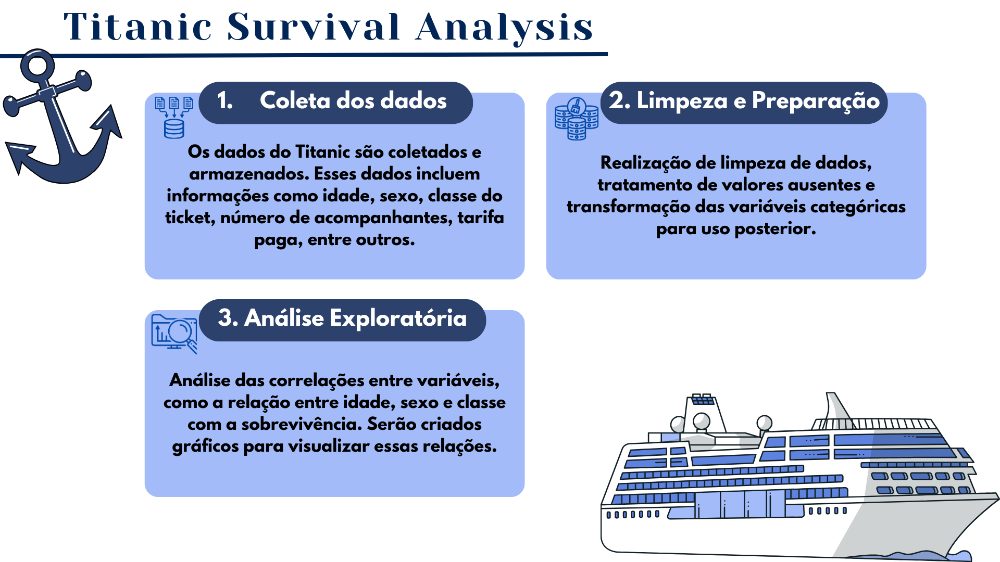

# Projeto Titanic

Este projeto tem como objetivo analisar o conjunto de 
dados do Titanic, investigando os principais fatores que 
influenciaram a sobrevivência dos passageiros durante 
o desastre. 

